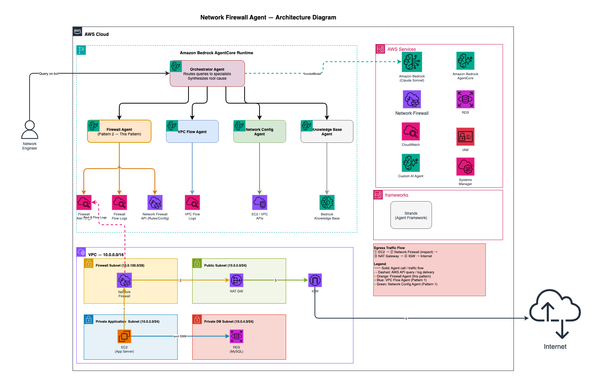

# Network Observability Agent

> **Important:** This project is a sample for educational purposes and is not intended for production use without additional security review and hardening. See [SECURITY.md](SECURITY.md) for production hardening recommendations.

A multi-agent system for AWS network troubleshooting built with [Strands Agents](https://github.com/strands-agents/strands-agents) and deployable to [Amazon Bedrock AgentCore](https://aws.amazon.com/bedrock/agentcore/).

## What It Does

This agent helps network engineers diagnose connectivity issues by combining:
- **VPC Flow Logs** - Analyze actual traffic patterns and blocked connections
- **Live AWS Config** - Query security groups, NACLs, and route tables  
- **Network Firewall** - Inspect firewall alerts, flows, and rule groups
- **Architecture Docs** - Understand design intent from your documentation

Instead of manually correlating data across multiple AWS consoles, ask questions like:
- "Why can't 10.0.1.50 connect to 10.0.2.100 on port 3306?"
- "Show me blocked traffic in the last hour"
- "What security groups are too permissive?"

## Architecture



```
                         User Query
                              │
                              ▼
                    ┌─────────────────┐
                    │   Orchestrator  │
                    │  (Claude Model) │
                    └────────┬────────┘
                             │
                             ▼
         Specialist agents (invoked as tools):
           • vpc_flow_agent        → VPC Flow Logs (CloudWatch Insights)
           • network_config_agent  → Live AWS config (EC2/VPC APIs)
           • knowledge_base_agent  → Architecture docs (Bedrock KB)
           • firewall_agent        → Network Firewall logs & rules
```

## Prerequisites

- Python 3.13 — the highest runtime the AgentCore starter toolkit supports (3.10–3.13 all work)
- AWS CLI configured with credentials
- pip (bundled with Python)

### AWS Resources Required

| Resource | Required | Purpose |
|----------|----------|---------|
| VPC with Flow Logs | Yes | Traffic analysis |
| Bedrock model access | Yes | Claude for reasoning |
| Bedrock Knowledge Base | Optional | Architecture docs |

---

## Quick Start

### 1. Clone and Install

```bash
git clone <repo-url>
cd network-agentic-ai-observability-assistant

# Create the venv with Python 3.13 to match the AgentCore runtime
python -m venv .venv
source .venv/bin/activate

# Runtime dependencies — what the agent needs to run, and what AgentCore installs at deploy
pip install -r requirements.txt
```

> **Single dependency file.** `requirements.txt` holds all dependencies (runtime,
> deploy CLI, and test tools) with pinned versions, so you run the same versions
> everywhere.

### 2. Configure Environment

Copy the template and fill in your values. Every variable is documented inline in `.env.example`:

```bash
cp .env.example .env
# then open .env and set each value for your environment
```

| Variable | Required? |
|----------|-----------|
| `AWS_REGION`, `BEDROCK_MODEL_ID`, `VPC_FLOW_LOG_GROUP` | Required |
| `FIREWALL_ALERT_LOG_GROUP`, `FIREWALL_FLOW_LOG_GROUP` | Optional (firewall agent) |
| `KNOWLEDGE_BASE_ID` | Optional (Knowledge Base agent) |

---

## AWS Setup

### Enable VPC Flow Logs

1. Go to **VPC Console → Your VPC → Flow logs**
2. Create flow log:
   - **Filter**: All
   - **Destination**: CloudWatch Logs
   - **Log group**: `/aws/vpc/flowlogs/your-vpc-name`
   - **Aggregation interval**: 1 minute (recommended for faster results)

### IAM Permissions

Your AWS credentials need these permissions:

```json
{
  "Version": "2012-10-17",
  "Statement": [
    {
      "Sid": "BedrockModel",
      "Effect": "Allow",
      "Action": ["bedrock:InvokeModel", "bedrock:InvokeModelWithResponseStream"],
      "Resource": [
        "arn:aws:bedrock:*:*:inference-profile/*",
        "arn:aws:bedrock:*::foundation-model/*"
      ]
    },
    {
      "Sid": "CloudWatchLogs",
      "Effect": "Allow",
      "Action": ["logs:StartQuery", "logs:GetQueryResults"],
      "Resource": [
        "arn:aws:logs:*:*:log-group:/aws/vpc/flowlogs/*",
        "arn:aws:logs:*:*:log-group:/aws/network-firewall/*"
      ]
    },
    {
      "Sid": "EC2Describe",
      "Effect": "Allow",
      "Action": [
        "ec2:DescribeNetworkInterfaces",
        "ec2:DescribeSecurityGroups",
        "ec2:DescribeNetworkAcls",
        "ec2:DescribeRouteTables",
        "ec2:DescribeSubnets"
      ],
      "Resource": "*"
    },
    {
      "Sid": "NetworkFirewall",
      "Effect": "Allow",
      "Action": [
        "network-firewall:ListFirewalls",
        "network-firewall:DescribeFirewall",
        "network-firewall:DescribeFirewallPolicy",
        "network-firewall:DescribeRuleGroup"
      ],
      "Resource": "*"
    },
    {
      "Sid": "BedrockKB",
      "Effect": "Allow",
      "Action": ["bedrock:Retrieve"],
      "Resource": "arn:aws:bedrock:*:*:knowledge-base/*"
    }
  ]
}
```

### Knowledge Base Setup (Optional)

1. Create S3 bucket and upload architecture docs (markdown, PDF, TXT)
2. Create Knowledge Base in **Bedrock Console → Knowledge bases**
3. Sync the data source
4. Add `KNOWLEDGE_BASE_ID` to your `.env`

Any markdown, PDF, or text documents describing your network architecture (topology, subnets, CIDR allocations, expected traffic flows) work well as source content.

---

## Run Locally

Once AWS Setup is complete, run the agent locally:

```bash
python main.py
```

```
🔍 You: Show me blocked traffic
🤖 Analyzing...

💡 Assistant:
## Blocked Traffic Summary
Found 50 rejected connections in the last hour...
```

---

## Deploy to AgentCore

### 1. Install AgentCore CLI

The `agentcore` CLI comes from `requirements.txt`. If you installed that, you can
skip this step; otherwise install it directly:

```bash
pip install bedrock-agentcore-starter-toolkit==0.3.11
```

### (Optional) Test locally with AgentCore Dev
```bash
agentcore dev
# In another terminal:
agentcore invoke --dev '{"prompt": "Hello"}'

```


### 2. Configure

Load your `.env` into the shell so the CLI targets the same region as the agent, then configure:

```bash
set -a && source .env && set +a
agentcore configure --entrypoint agent.py --name NetworkObservabilityAgent --region "$AWS_REGION" --non-interactive
```

### 3. Deploy

Deploy with the environment variables from your `.env` (run in the same shell where you sourced `.env` above):

```bash
agentcore deploy \
  --env AWS_REGION="$AWS_REGION" \
  --env BEDROCK_MODEL_ID="$BEDROCK_MODEL_ID" \
  --env VPC_FLOW_LOG_GROUP="$VPC_FLOW_LOG_GROUP" \
  --env FIREWALL_ALERT_LOG_GROUP="$FIREWALL_ALERT_LOG_GROUP" \
  --env FIREWALL_FLOW_LOG_GROUP="$FIREWALL_FLOW_LOG_GROUP" \
  --env KNOWLEDGE_BASE_ID="$KNOWLEDGE_BASE_ID"
```

Omit the `FIREWALL_*` and `KNOWLEDGE_BASE_ID` lines if you're not using Network Firewall or a Knowledge Base.

> **Note:** Older versions of the starter toolkit used `agentcore launch` (now `deploy`) and `agentcore stop` (now `destroy`). If you see "no such command" errors, upgrade with `pip install --upgrade bedrock-agentcore-starter-toolkit==0.3.11`.

### 4. Add IAM Permissions to Execution Role

Get the role name:
```bash
agentcore status --verbose
```

Attach the permissions the agents need — Bedrock model invocation (via inference profile), CloudWatch Logs Insights for VPC flow **and** firewall logs, EC2 describe, Network Firewall describe, and Knowledge Base retrieval:
```bash
aws iam put-role-policy --role-name <ROLE_NAME> --policy-name NetworkAnalyzerAccess \
  --policy-document '{
    "Version":"2012-10-17",
    "Statement":[
      {
        "Sid":"BedrockModel",
        "Effect":"Allow",
        "Action":["bedrock:InvokeModel","bedrock:InvokeModelWithResponseStream"],
        "Resource":[
          "arn:aws:bedrock:*:*:inference-profile/*",
          "arn:aws:bedrock:*::foundation-model/*"
        ]
      },
      {
        "Sid":"CloudWatchLogs",
        "Effect":"Allow",
        "Action":["logs:StartQuery","logs:GetQueryResults"],
        "Resource":[
          "arn:aws:logs:*:*:log-group:/aws/vpc/flowlogs/*",
          "arn:aws:logs:*:*:log-group:/aws/network-firewall/*"
        ]
      },
      {
        "Sid":"EC2Describe",
        "Effect":"Allow",
        "Action":[
          "ec2:DescribeNetworkInterfaces",
          "ec2:DescribeSecurityGroups",
          "ec2:DescribeNetworkAcls",
          "ec2:DescribeRouteTables",
          "ec2:DescribeSubnets"
        ],
        "Resource":"*"
      },
      {
        "Sid":"NetworkFirewall",
        "Effect":"Allow",
        "Action":[
          "network-firewall:ListFirewalls",
          "network-firewall:DescribeFirewall",
          "network-firewall:DescribeFirewallPolicy",
          "network-firewall:DescribeRuleGroup"
        ],
        "Resource":"*"
      },
      {
        "Sid":"BedrockKB",
        "Effect":"Allow",
        "Action":["bedrock:Retrieve"],
        "Resource":"arn:aws:bedrock:*:*:knowledge-base/*"
      }
    ]
  }'
```

### 5. Test Deployment

```bash
# Basic invoke
agentcore invoke '{"prompt": "Show me blocked traffic"}'
```

### Useful AgentCore Commands

```bash
agentcore status           # Check deployment status
agentcore status --verbose # Get execution role name
agentcore logs             # View logs
agentcore destroy          # Tear down the agent
```

---

## Project Structure

```
├── agent.py                    # AgentCore entrypoint
├── main.py                     # Local CLI for testing
│
├── agents/
│   ├── orchestrator.py         # Routes queries to specialist agents
│   ├── vpc_flow_agent.py       # Analyzes VPC Flow Logs
│   ├── network_config_agent.py # Queries live AWS config
│   ├── knowledge_base_agent.py # Queries architecture docs
│   └── firewall_agent.py       # Analyzes AWS Network Firewall logs
│
├── tools/
│   ├── vpc_flow_tools.py       # CloudWatch Logs Insights queries
│   ├── network_config_tools.py # EC2/VPC API calls
│   ├── kb_tools.py             # Bedrock KB retrieval
│   ├── firewall_tools.py       # Network Firewall logs & config
│   └── validation.py           # Shared input validation helpers
│
└── config/
    └── prompts.py              # System prompts for agents
```

---

## Example Queries

| Query | Agents Used | What It Does |
|-------|-------------|--------------|
| `Show me blocked traffic` | vpc_flow_agent | Lists rejected connections from flow logs |
| `What security groups does 10.0.2.50 have?` | network_config_agent | Finds ENI and associated SGs |
| `What is the network architecture?` | knowledge_base_agent | Retrieves design docs |
| `Why can't X connect to Y on port 3306?` | All four | Full connectivity analysis |
| `What traffic is the firewall blocking?` | firewall_agent | Summarizes Network Firewall alerts |
| `Find overly permissive security groups` | network_config_agent | Finds 0.0.0.0/0 rules |

### Agent Query Examples

Agents take natural language — no special syntax. The orchestrator routes each query to the right specialist.

**vpc_flow_agent:**
- "Show all rejected traffic in the last hour"
- "Is 10.0.1.50 able to reach 10.0.2.100 on port 3306?"
- "Summarize the top blocked connections"

**network_config_agent:**
- "What security groups does 10.0.1.50 have?"
- "Show inbound and outbound rules for sg-abc123"
- "Are there any permissive (0.0.0.0/0) security groups in vpc-123?"

**knowledge_base_agent:**
- "What is the expected traffic flow between the app and database tiers?"
- "What are the CIDR blocks for each subnet?"

**firewall_agent:**
- "What traffic is being blocked by the firewall?"
- "Is 10.0.1.50 being blocked from reaching 203.0.113.99 on port 443?"
- "What rules are in the egress-filter rule group?"

---

## Extending the Agent

### Add a New Agent

1. Create tool functions in `tools/`:
```python
# tools/my_tools.py
def my_data_source_query(param: str) -> str:
    # Query your data source
    return results
```

2. Create agent in `agents/`:
```python
# agents/my_agent.py
from strands import tool
from tools.my_tools import my_data_source_query

@tool
def my_agent(query: str) -> str:
    """Description of what this agent does."""
    return my_data_source_query(query)
```

3. Add to orchestrator in `agents/orchestrator.py`:
```python
from agents.my_agent import my_agent

orchestrator = Agent(
    tools=[vpc_flow_agent, network_config_agent, knowledge_base_agent, firewall_agent, my_agent],
    # ...
)
```

4. Update system prompt in `config/prompts.py`

### Ideas for Additional Agents

- **CloudTrail Agent** - Audit who changed security groups
- **DNS Agent** - Query Route 53 Resolver logs
- **Remediation Agent** - Actually fix issues (add SG rules)

---

## Troubleshooting

**"VPC_FLOW_LOG_GROUP not configured"**
- Set the environment variable in `.env` or pass via `--env` flag to agentcore

**"No results found in flow logs"**
- Verify flow logs are enabled and data is flowing
- Check the log group name matches exactly
- Wait 5-10 minutes after enabling flow logs for data to appear

**"Access denied" errors**
- Verify IAM permissions for CloudWatch Logs, EC2, and Bedrock
- For AgentCore, add policies to the execution role (see Deploy section)

**"KNOWLEDGE_BASE_ID not configured"**
- This is optional - the agent works without it
- To use: create a Bedrock KB and add the ID to `.env`

**Agent returns duplicate output**
- The orchestrator has `callback_handler=None` to prevent this
- If you modify the code, ensure this setting is preserved

---

## License

MIT-0 — See [LICENSE](LICENSE)

